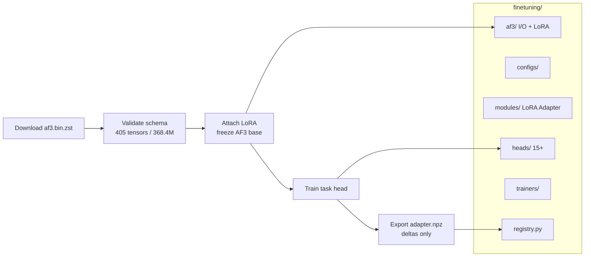

# AlphaFold Codec

Fine-tune **AlphaFold 3**, **AlphaFold 2**, **Boltz-1**, and **Boltz-2** on downstream protein tasks. Algorithm notebooks and papers are the supporting layer.

[](finetuning/FINETUNING_GUIDE.md)
[](#alphafold-3-weights)
[](#learning-by-code)
[](#references)

| Start here | Link |
|------------|------|
| Fine-tuning guide | [finetuning/FINETUNING_GUIDE.md](finetuning/FINETUNING_GUIDE.md) |
| AF3 weight + LoRA design | [alphafold3/AF3_WEIGHTS_FINETUNING_DESIGN.md](alphafold3/AF3_WEIGHTS_FINETUNING_DESIGN.md) |
| AF3 module | [`finetuning/af3/`](finetuning/af3/) |
| Architecture figure | [`assets/architecture.svg`](assets/architecture.svg) |

---

## Fine-tuning (primary)

This repo is built around a shared `finetuning/` framework. Official AlphaFold 3 **v3.0.4** weights are now a public `.bin.zst` file (no request form). This repo loads that checkpoint, validates all 405 tensors, attaches LoRA, and exports **adapter-only** files so you never redistribute the base weights.

### Architecture (fine-tune first)

<p align="center">
  
</p>

<details>
<summary><b>Text / Mermaid fallback</b> (if the SVG does not render)</summary>



**Flow**

1. Download / check AF3 weights (`python -m finetuning.af3.weights`)
2. Attach LoRA on Pairformer + Diffusion (`AlphaFold3FineTuner`)
3. Train a task head (affinity, antibody, enzyme, PPI, ...)
4. Save `adapter.npz` only (base AF3 weights stay frozen and are not written)

**Then** the four model families (`alphafold2/`, `alphafold3/`, `boltz/`, `boltz2/`) provide notebooks and papers.

</details>

### Supported models and strategies

| Model | Runtime | Fine-tune | Notes |
|-------|---------|-----------|--------|
| **AlphaFold 3** | JAX / Haiku | Full, Head-only, **LoRA** | Public weights `af3.bin.zst`; use [`finetuning/af3`](finetuning/af3/) |
| **AlphaFold 2** | JAX / Haiku | Full, Head-only, LoRA | 32 algorithm notebooks |
| **Boltz-1** | PyTorch | Full, LoRA, Adapter | Open AF3-class interactions |
| **Boltz-2** | PyTorch | Full, LoRA, Adapter | Binding-affinity head |

| Strategy | Trainable params | When to use |
|----------|------------------|-------------|
| **LoRA** | ~0.1–3% | Default for AF3; small data |
| **Adapter** | ~1% | Modular / multi-task |
| **Head-only** | ~5% | New prediction task |
| **Full** | 100% | Large data, max accuracy |

### AlphaFold 3 weights

DeepMind now publishes parameters at a public URL (compatible with any `3.0.x` code):

- File: https://storage.googleapis.com/alphafold3/af3.bin.zst
- Terms (non-commercial, do not redistribute weights): [WEIGHTS_TERMS_OF_USE.md](https://github.com/google-deepmind/alphafold3/blob/main/WEIGHTS_TERMS_OF_USE.md)
- Schema in this repo: 405 entries, 368,384,602 parameters (metadata only)

```bash
pip install numpy zstandard

python -m finetuning.af3.weights info
python -m finetuning.af3.weights download /path/to/weights --accept-terms
python -m finetuning.af3.weights check /path/to/weights
```

```python
from finetuning.af3 import AlphaFold3FineTuner, AF3FineTuneConfig, LoRAConfig

config = AF3FineTuneConfig(strategy="lora", lora=LoRAConfig(rank=8, alpha=16.0))
tuner = AlphaFold3FineTuner.from_pretrained("/path/to/weights/", config)
print(tuner.parameter_summary().describe())

# Adapter-only export: does not write AF3 base weight values
tuner.save_adapter("./af3_lora_adapter.npz")

# Merged checkpoint is restricted; requires an explicit acknowledgement
# tuner.export_merged_weights("./merged.bin", acknowledge_weights_terms=True)
```

### Task-registry quick start (Boltz / PyTorch)

```python
from finetuning import TaskRegistry, create_finetuning_pipeline
from finetuning.modules import LoRAModule
from finetuning.heads import AffinityHead, AffinityHeadConfig
from finetuning import FineTuningConfig, Trainer

print(TaskRegistry.list_all_tasks())  # 50+ tasks
info = TaskRegistry.get_task_info("binding_affinity")

pipeline = create_finetuning_pipeline(
    task="binding_affinity",
    base_model=model,
    strategy="lora",
)

# Or assemble manually
lora_model = LoRAModule(model, rank=8, alpha=16.0)
head = AffinityHead(AffinityHeadConfig())
trainer = Trainer(lora_model, FineTuningConfig(strategy="lora", task="binding_affinity"), train_loader, val_loader)
trainer.train()
lora_model.save_lora_weights("./lora_weights.pt")
```

### Downstream tasks (50+)

<details>
<summary><b>Drug discovery</b></summary>

| Task | Outputs | Applications |
|------|---------|--------------|
| Binding Affinity | pKd, pIC50, dG, Ki | Lead optimization, SAR |
| Virtual Screening | Hit probability, ranking | HTS prioritization |
| ADMET | Absorption, metabolism, toxicity | Compound triage |

</details>

<details>
<summary><b>Protein engineering</b></summary>

| Task | Outputs | Applications |
|------|---------|--------------|
| Stability | ddG, Tm shift | Thermostabilization |
| Solubility | Expression score | Biomanufacturing |
| Mutation Effects | Fitness, pathogenicity | Variant analysis |

</details>

<details>
<summary><b>Antibody design</b></summary>

| Task | Outputs | Applications |
|------|---------|--------------|
| Affinity Maturation | CDR binding, ddG | Therapeutic optimization |
| Humanization | Humanness score | Drug development |
| Developability | Aggregation, viscosity | Manufacturing |

</details>

<details>
<summary><b>Enzyme / PPI / function / immunology / quality</b></summary>

| Category | Outputs |
|----------|---------|
| Enzyme | kcat, Km, specificity, directed evolution |
| PPI | Kd, interface residues, hot-spot ddG |
| Function | GO terms, EC numbers, localization |
| Immunology | B/T epitopes, ADA risk |
| Structure quality | pLDDT, pAE, contacts, disorder |

</details>

### `finetuning/` layout

```
finetuning/
├── af3/                 # AF3 binary I/O, schema, LoRA, CLI, FineTuner
├── configs/             # FineTuningConfig + task / LoRA presets
├── modules/             # LoRA, Adapter, prompt tuning
├── heads/               # Affinity, antibody, PPI, enzyme, GO, epitope, ...
├── trainers/            # Trainer, DistributedTrainer, callbacks
├── data/                # Datasets and transforms
├── registry.py          # TaskRegistry + create_finetuning_pipeline
├── tests/               # 101 unit tests for AF3 weight / LoRA path
└── FINETUNING_GUIDE.md
```

---

## Repository layout

```
alphafold-notebooks/
├── finetuning/          # PRIMARY: shared fine-tuning framework
├── alphafold3/          # AF3 notebooks (23) + weight design doc
├── alphafold2/          # AF2 notebooks (32) + source/
├── boltz/               # Boltz-1 notebooks (20)
├── boltz2/              # Boltz-2 notebooks (10)
├── assets/architecture.svg
└── .gitmodules          # 14 reference submodules
```

```bash
git submodule update --init --recursive
```

| Model | Notebooks | Index | Papers |
|-------|-----------|-------|--------|
| AlphaFold 2 | 32 | [ALGORITHM_INDEX](alphafold2/notebooks/ALGORITHM_INDEX.md) | [AF2REFPAPERS](alphafold2/AF2REFPAPERS.md) |
| AlphaFold 3 | 23 | [ALGORITHM_INDEX](alphafold3/notebooks/ALGORITHM_INDEX.md) | [AF3REFPAPERS](alphafold3/AF3REFPAPERS.md) |
| Boltz-1 | 20 | [ALGORITHM_INDEX](boltz/notebooks/ALGORITHM_INDEX.md) | [BOLTZREFPAPERS](boltz/BOLTZREFPAPERS.md) |
| Boltz-2 | 10 | [ALGORITHM_INDEX](boltz2/notebooks/ALGORITHM_INDEX.md) | [BOLTZ2REFPAPERS](boltz2/BOLTZ2REFPAPERS.md) |

---

# Learning Source Availability
## Papers
- [Jumper, J., Evans, R., Pritzel, A. et al. Highly accurate protein structure prediction with AlphaFold. Nature (2021). https://doi.org/10.1038/s41586-021-03819-2](https://www.nature.com/articles/s41586-021-03819-2)
  
## PPT 
- My Public talk on Alphafold2 Paper Reading By Xingqiang,Chen [.Key](https://github.com/chenxingqiang/ref-Alphafold-Code/blob/main/AF2-PPT/2021-07-30-AlphaFold2-paper-sharing-chen-xingqiang.key)/[.pptx](https://github.com/chenxingqiang/ref-Alphafold-Code/blob/main/AF2-PPT/2021-07-30-AlphaFold2-paper-sharing-chen-xingqiang.pptx)
in AF2-PPT file.
- Sergey Ovchinnikov talk on AF2 
[slides](https://docs.google.com/presentation/d/1mnffk23ev2QMDzGZ5w1skXEadTe54l8-Uei6ACce8eI/edit#slide=id.p) /[.pptx](https://github.com/chenxingqiang/ref-Alphafold-Code/blob/main/AF2-PPT/ColabFold.pptx) in AF2-PPT file.

## Learning by Code  

### 📓 AlphaFold2 Algorithm Notebooks (32 Complete!)

We provide **32 Jupyter Notebooks** covering every algorithm from the AlphaFold2 supplementary materials. Each notebook includes:
- Algorithm pseudocode/image reference
- Source code location mapping
- NumPy implementation
- Executable test cases with verification

👉 **[Full Algorithm Index](alphafold2/notebooks/ALGORITHM_INDEX.md)**

#### Quick Links by Category

| Category | Algorithms | Notebooks |
|----------|------------|-----------|
| **Data Preprocessing** | MSA Block Deletion | [Algorithm 1](alphafold2/notebooks/algorithm-1-MSABlockDeletion.ipynb) |
| **Embedding** | Input Embedder, relpos, one_hot | [Alg 3](alphafold2/notebooks/algorithm-3-InputEmbedder.ipynb), [Alg 4](alphafold2/notebooks/algorithm-4-relpos.ipynb), [Alg 5](alphafold2/notebooks/algorithm-5-one_hot.ipynb) |
| **Evoformer** | Stack, MSA Attention, Triangle Ops | [Alg 6-15](alphafold2/notebooks/) |
| **Templates** | Pair Stack, Pointwise Attention | [Alg 16](alphafold2/notebooks/algorithm-16-TemplatePairStack.ipynb), [Alg 17](alphafold2/notebooks/algorithm-17-TemplatePointwiseAttention.ipynb) |
| **Extra MSA** | Stack, Global Attention | [Alg 18](alphafold2/notebooks/algorithm-18-ExtraMsaStack.ipynb), [Alg 19](alphafold2/notebooks/algorithm-19-MSAColumnGlobalAttention.ipynb) |
| **Structure Module** | IPA, Backbone, Atom Coords | [Alg 20-25](alphafold2/notebooks/) |
| **Losses** | FAPE, Torsion, pLDDT | [Alg 26-29](alphafold2/notebooks/) |
| **Recycling** | Inference, Training, Embedder | [Alg 30](alphafold2/notebooks/algorithm-30-RecyclingInference.ipynb), [Alg 31](alphafold2/notebooks/algorithm-31-RecyclingTraining.ipynb), [Alg 32](alphafold2/notebooks/algorithm-32-RecyclingEmbedder.ipynb) |
| **Main Pipeline** | Full Inference | [Algorithm 2](alphafold2/notebooks/algorithm-2-Inference.ipynb) |

<details>
<summary><b>📋 Complete Algorithm List (Click to Expand)</b></summary>

| # | Algorithm | Notebook Link |
|---|-----------|---------------|
| 1 | MSA Block Deletion | [algorithm-1-MSABlockDeletion.ipynb](alphafold2/notebooks/algorithm-1-MSABlockDeletion.ipynb) |
| 2 | Inference | [algorithm-2-Inference.ipynb](alphafold2/notebooks/algorithm-2-Inference.ipynb) |
| 3 | Input Embedder | [algorithm-3-InputEmbedder.ipynb](alphafold2/notebooks/algorithm-3-InputEmbedder.ipynb) |
| 4 | relpos | [algorithm-4-relpos.ipynb](alphafold2/notebooks/algorithm-4-relpos.ipynb) |
| 5 | one_hot | [algorithm-5-one_hot.ipynb](alphafold2/notebooks/algorithm-5-one_hot.ipynb) |
| 6 | Evoformer Stack | [algorithm-6-EvoformerStack.ipynb](alphafold2/notebooks/algorithm-6-EvoformerStack.ipynb) |
| 7 | MSA Row Attention with Pair Bias | [algorithm-7-MSARowAttentionWithPairBias.ipynb](alphafold2/notebooks/algorithm-7-MSARowAttentionWithPairBias.ipynb) |
| 8 | MSA Column Attention | [algorithm-8-MSAColumnAttention.ipynb](alphafold2/notebooks/algorithm-8-MSAColumnAttention.ipynb) |
| 9 | MSA Transition | [algorithm-9-MSATransition.ipynb](alphafold2/notebooks/algorithm-9-MSATransition.ipynb) |
| 10 | Outer Product Mean | [algorithm-10-OuterProductMean.ipynb](alphafold2/notebooks/algorithm-10-OuterProductMean.ipynb) |
| 11 | Triangle Multiplication (Outgoing) | [algorithm-11-TriangleMultiplicationOutgoing.ipynb](alphafold2/notebooks/algorithm-11-TriangleMultiplicationOutgoing.ipynb) |
| 12 | Triangle Multiplication (Incoming) | [algorithm-12-TriangleMultiplicationIncoming.ipynb](alphafold2/notebooks/algorithm-12-TriangleMultiplicationIncoming.ipynb) |
| 13 | Triangle Attention (Starting Node) | [algorithm-13-TriangleAttentionStartingNode.ipynb](alphafold2/notebooks/algorithm-13-TriangleAttentionStartingNode.ipynb) |
| 14 | Triangle Attention (Ending Node) | [algorithm-14-TriangleAttentionEndingNode.ipynb](alphafold2/notebooks/algorithm-14-TriangleAttentionEndingNode.ipynb) |
| 15 | Pair Transition | [algorithm-15-PairTransition.ipynb](alphafold2/notebooks/algorithm-15-PairTransition.ipynb) |
| 16 | Template Pair Stack | [algorithm-16-TemplatePairStack.ipynb](alphafold2/notebooks/algorithm-16-TemplatePairStack.ipynb) |
| 17 | Template Pointwise Attention | [algorithm-17-TemplatePointwiseAttention.ipynb](alphafold2/notebooks/algorithm-17-TemplatePointwiseAttention.ipynb) |
| 18 | Extra MSA Stack | [algorithm-18-ExtraMsaStack.ipynb](alphafold2/notebooks/algorithm-18-ExtraMsaStack.ipynb) |
| 19 | MSA Column Global Attention | [algorithm-19-MSAColumnGlobalAttention.ipynb](alphafold2/notebooks/algorithm-19-MSAColumnGlobalAttention.ipynb) |
| 20 | Structure Module | [algorithm-20-StructureModule.ipynb](alphafold2/notebooks/algorithm-20-StructureModule.ipynb) |
| 21 | Rigid from 3 Points | [algorithm-21-rigidFrom3Points.ipynb](alphafold2/notebooks/algorithm-21-rigidFrom3Points.ipynb) |
| 22 | Invariant Point Attention | [algorithm-22-InvariantPointAttention.ipynb](alphafold2/notebooks/algorithm-22-InvariantPointAttention.ipynb) |
| 23 | Backbone Update | [algorithm-23-BackboneUpdate.ipynb](alphafold2/notebooks/algorithm-23-BackboneUpdate.ipynb) |
| 24 | Compute All Atom Coordinates | [algorithm-24-computeAllAtomCoordinates.ipynb](alphafold2/notebooks/algorithm-24-computeAllAtomCoordinates.ipynb) |
| 25 | makeRotX | [algorithm-25-makeRotX.ipynb](alphafold2/notebooks/algorithm-25-makeRotX.ipynb) |
| 26 | Rename Symmetric Ground Truth Atoms | [algorithm-26-renameSymmetricGroundTruthAtoms.ipynb](alphafold2/notebooks/algorithm-26-renameSymmetricGroundTruthAtoms.ipynb) |
| 27 | Torsion Angle Loss | [algorithm-27-torsionAngleLoss.ipynb](alphafold2/notebooks/algorithm-27-torsionAngleLoss.ipynb) |
| 28 | Compute FAPE | [algorithm-28-computeFAPE.ipynb](alphafold2/notebooks/algorithm-28-computeFAPE.ipynb) |
| 29 | Predict Per-Residue LDDT | [algorithm-29-predictPerResidueLDDT.ipynb](alphafold2/notebooks/algorithm-29-predictPerResidueLDDT.ipynb) |
| 30 | Recycling (Inference) | [algorithm-30-RecyclingInference.ipynb](alphafold2/notebooks/algorithm-30-RecyclingInference.ipynb) |
| 31 | Recycling (Training) | [algorithm-31-RecyclingTraining.ipynb](alphafold2/notebooks/algorithm-31-RecyclingTraining.ipynb) |
| 32 | Recycling Embedder | [algorithm-32-RecyclingEmbedder.ipynb](alphafold2/notebooks/algorithm-32-RecyclingEmbedder.ipynb) |

</details>

### 📓 AlphaFold3 Algorithm Notebooks (NEW!)

We now include **AlphaFold3** algorithm notebooks! AF3 introduces significant architectural changes including diffusion-based structure prediction.

👉 **[AlphaFold3 Algorithm Index](alphafold3/notebooks/ALGORITHM_INDEX.md)**

#### Key AF3 Components

| Category | Key Algorithms | Notebooks |
|----------|---------------|-----------|
| **Input** | MSA Features, Templates, Atom Features | [Alg 1-4](alphafold3/notebooks/) |
| **MSA Module** | Outer Product, MSA Attention | [Alg 5-7](alphafold3/notebooks/) |
| **Pairformer** | Triangle Ops, Single Attention | [Alg 8-14](alphafold3/notebooks/algorithm-08-PairformerStack.ipynb) |
| **Diffusion** | Diffusion Module, AdaLN, Transformer | [Alg 15](alphafold3/notebooks/algorithm-15-DiffusionModule.ipynb), [Alg 16](alphafold3/notebooks/algorithm-16-AdaptiveLayerNorm.ipynb) |
| **Confidence** | Distogram, Confidence, LDDT | [Alg 20-23](alphafold3/notebooks/) |

#### AF3 Source Code Submodules

```bash
# Official AlphaFold3
alphafold3/ref-src/alphafold3-official/

# PyTorch Implementation (lucidrains)
alphafold3/ref-src/alphafold3-pytorch/

# Architecture Walkthrough
alphafold3/ref-src/alphafold3-walkthrough/
```

Weights, LoRA, and the fine-tuning CLI are documented at the top: [Fine-tuning (primary)](#fine-tuning-primary).

### 📓 Boltz Algorithm Notebooks (NEW!)

We now include **Boltz** algorithm notebooks! Boltz is a family of models for biomolecular interaction prediction:
- **Boltz-1**: First fully open source model to approach AlphaFold3 accuracy
- **Boltz-2**: Adds binding affinity prediction, approaching FEP accuracy 1000x faster

👉 **[Boltz Algorithm Index](boltz/notebooks/ALGORITHM_INDEX.md)**

#### Key Boltz Components

| Category | Key Algorithms | Notebooks |
|----------|---------------|-----------|
| **Input Processing** | Input Embedder, Atom Encoder, RelPos | [Alg 1-3](boltz/notebooks/) |
| **MSA Module** | MSA Module, Outer Product, Pair Averaging | [Alg 4-6](boltz/notebooks/) |
| **Pairformer** | Pairformer, Triangle Ops, Attention | [Alg 7-11](boltz/notebooks/) |
| **Diffusion** | Diffusion Module, Transformer, Fourier | [Alg 12-15](boltz/notebooks/) |
| **Confidence & Affinity** | Confidence, Distogram, Affinity (Boltz-2) | [Alg 16-18](boltz/notebooks/) |
| **Loss Functions** | Diffusion Loss, Confidence Loss | [Alg 19-20](boltz/notebooks/) |

#### Boltz Source Code Submodule

```bash
# Official Boltz Repository
boltz/ref-src/boltz-official/
```

**Papers:**
- [Boltz-1: bioRxiv 2024.11.19.624167](https://doi.org/10.1101/2024.11.19.624167)
- [Boltz-2: bioRxiv 2025.06.14.659707](https://doi.org/10.1101/2025.06.14.659707)

### 📓 Boltz-2 Specific Notebooks (NEW!)

Boltz-2 introduces **binding affinity prediction** - the first DL model approaching FEP accuracy while being 1000x faster.

👉 **[Boltz-2 Algorithm Index](boltz2/notebooks/ALGORITHM_INDEX.md)**

#### Boltz-2 New Features

| Category | Key Algorithms | Notebooks |
|----------|---------------|-----------|
| **Affinity Prediction** | Affinity Module, Gaussian Smearing | [Alg 1-2](boltz2/notebooks/) |
| **Contact Guidance** | Contact Conditioning | [Alg 3](boltz2/notebooks/algorithm-03-ContactConditioning.ipynb) |
| **Enhanced v2 Modules** | Input v2, Template v2, Diffusion v2 | [Alg 5-7](boltz2/notebooks/) |
| **Improved Confidence** | Confidence v2, B-Factor | [Alg 8, 10](boltz2/notebooks/) |

#### Boltz-2 Submodules

```bash
# Official Repository (contains both Boltz-1 and Boltz-2)
boltz/ref-src/boltz-official/

# Boltzina - Virtual Screening with Boltz-2
boltz/ref-src/boltzina/
```

### Practice on Modeling Test of AF2
- https://github.com/sokrypton/ColabFold.git

### MD+Alphafold2
- https://github.com/pablo-arantes/Making-it-rain

Fine-tuning APIs, AF3 weights, LoRA, and task heads live at the top of this README: [Fine-tuning (primary)](#fine-tuning-primary). Full guide: [finetuning/FINETUNING_GUIDE.md](finetuning/FINETUNING_GUIDE.md).

---

## Blogs 
- [DeepMind: AlphaFold-Using-AI-for-scientific-discovery](https://deepmind.com/blog/article/AlphaFold-Using-AI-for-scientific-discovery)
- [DeepMind: alphafold-a-solution-to-a-50-year-old-grand-challenge-in-biology](https://deepmind.com/blog/article/alphafold-a-solution-to-a-50-year-old-grand-challenge-in-biology)
- [DeepMind: putting-the-power-of-alphafold-into-the-worlds-hands](https://deepmind.com/blog/article/putting-the-power-of-alphafold-into-the-worlds-hands)
# References 
## reference papers
- [Reference papers list](https://github.com/chenxingqiang/ref-Alphafold-Code/blob/main/AF2REFPAPERS.md) here and you can download them by [Baidu Cloud Driver Link](https://pan.baidu.com/s/131uRwemUTwGvY-6kqxCYDA) with the code 9w2p.
- Reference Papers' Source Codes are managed via git submodules in `alphafold2/ref-src/`

### 📦 AlphaFold2 Reference Source Code (Submodules)

```bash
# Official AlphaFold (DeepMind)
alphafold2/ref-src/alphafold-official/

# OpenFold (PyTorch implementation)
alphafold2/ref-src/openfold/

# ColabFold (Colab-friendly version)
alphafold2/ref-src/colabfold/

# MMseqs2 (Sequence search)
alphafold2/ref-src/mmseqs2/

# HH-suite (Template search)
alphafold2/ref-src/hh-suite/

# trRosetta2 (Predecessor model)
alphafold2/ref-src/trRosetta2/

# ESM (Facebook protein language model)
alphafold2/ref-src/esm/

# UniRep (Protein representations)
alphafold2/ref-src/unirep/

# SeqVec (Sequence embeddings)
alphafold2/ref-src/seqvec/
```

To initialize submodules after cloning:
```bash
git submodule update --init --recursive
```


# Data availability
All input data are freely available from public sources.

Structures from the PDB were used for training and as templates (https://www.wwpdb.org/ftp/pdb-ftp-sites; for the associated sequence data and 40% sequence clustering see also https://ftp.wwpdb.org/pub/pdb/derived_data/ and https://cdn.rcsb.org/resources/sequence/clusters/bc-40.out).

 Training used a version of the PDB downloaded 28/08/2019, while CASP14 template search used a version downloaded 14/05/2020. Template search also used the PDB70 data- base, downloaded 13/05/2020 (https://wwwuser.gwdg.de/~compbiol/data/hhsuite/databases/hhsuite_dbs/).

We show experimental structures from the PDB with accessions
6Y4F<sup>76</sup>, 6YJ1<sup>77</sup>, 6VR4<sup>78</sup>, 6SK0<sup>79</sup>, 6FES<sup>80</sup>, 6W6W<sup>81</sup>, 6T1Z<sup>82</sup>, and 7JTL<sup>83</sup>. 

For MSA lookup at both training and prediction time, 

we used UniRef90 v2020_01 (https://ftp.ebi.ac.uk/pub/databases/uniprot/previous_releases/release-2020_01/uniref/), 

BFD (https://bfd.mmseqs.com), Uniclust30 v2018_08 (https://wwwuser.gwdg.de/~compbiol/uniclust/2018_08/), 

and MGnify clusters v2018_12 (https://ftp.ebi.ac.uk/pub/databases/metagenomics/peptide_database/2018_12/). Uniclust30 v2018_08 was further used as input for constructing a distillation structure dataset.


# Code and programmings availability
### Source code
 for the AlphaFold model, trained weights, and an inference script is available under an open-source license at https://github.com/deepmind/alphafold. 

### Neural networks
 Neural networks were developed with 
- TensorFlow v1 (https://github.com/tensorflow/tensorflow), 
- Sonnet v1 (https://github.com/deepmind/sonnet),
- JAX v0.1.69 (https://github.com/google/jax/), 
- Haiku v0.0.4 (https://github.com/deepmind/dm-haiku).

### MSA search
For MSA search on 
- UniRef90, MGnify clusters, 
and reduced BFD we used jackhmmer and for template search on the PDB SEQRES we used 
- hmmsearch, both from HMMER v3.3 (http://eddylab.org/soft-ware/hmmer/).

For template search against PDB70, we used HHsearch from HH-suite v3.0-beta.3 14/07/2017 (https://github.com/soedinglab/hh-suite). 
For constrained relaxation of structures, we used OpenMM v7.3.1 (https://github.com/openmm/openmm) with the Amber99sb force field.


### Docking analysis
 Docking analysis on DGAT used 
 - P2Rank v2.1 (https://github.com/rdk/p2rank), 
 - MGLTools v1.5.6 (https://ccsb.scripps.edu/mgltools/) 
 - and AutoDockVina v1.1.2 (http://vina.scripps.edu/download/) on a workstation running Debian GNU/Linux rodete 5.10.40-1rodete1-amd64 x86_64.

### Data analysis 
Data analysis used 
- Python v3.6 (https://www.python.org/), 
- NumPy v1.16.4 (https://github.com/numpy/numpy), 
- SciPy v1.2.1 (https://www.scipy.org/), 
- seaborn v0.11.1 (https://github.com/mwaskom/seaborn), 
- scikit-learn v0.24.0 (https://github.com/scikit-learn/), 
- Matplotlib v3.3.4 (https://github.com/matplotlib/matplotlib), 
- pandas v1.1.5 (https://github.com/pandas-dev/pandas), 
- and Colab (https://research.google.com/colaboratory). 
- TM-align v20190822 (https://zhanglab.dcmb.med.umich.edu/TM-align) was used for computing TM-scores.

 ### Structure analysis  
 Structure analysis used Pymol v2.3.0 (https://github.com/schrodinger/pymol-open-source).
